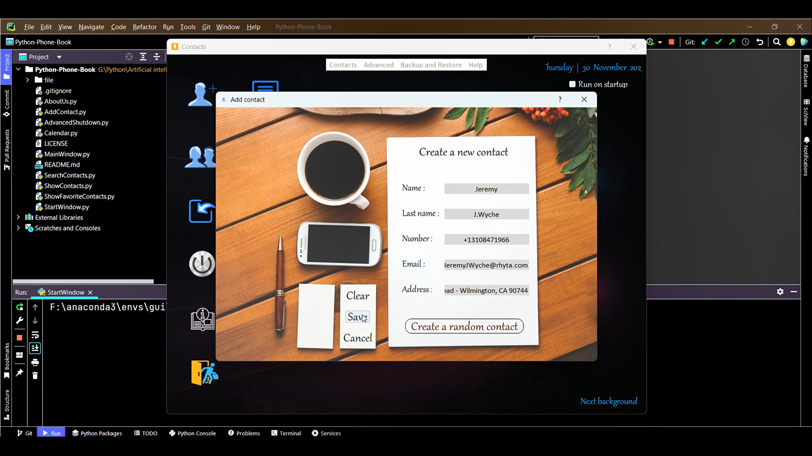
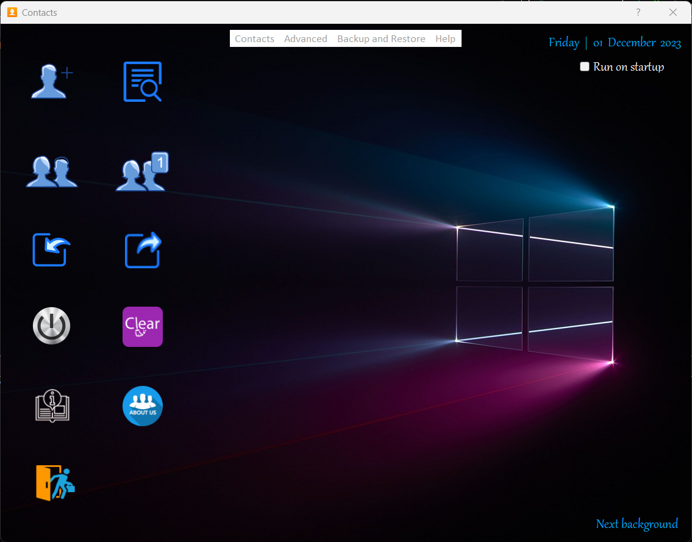
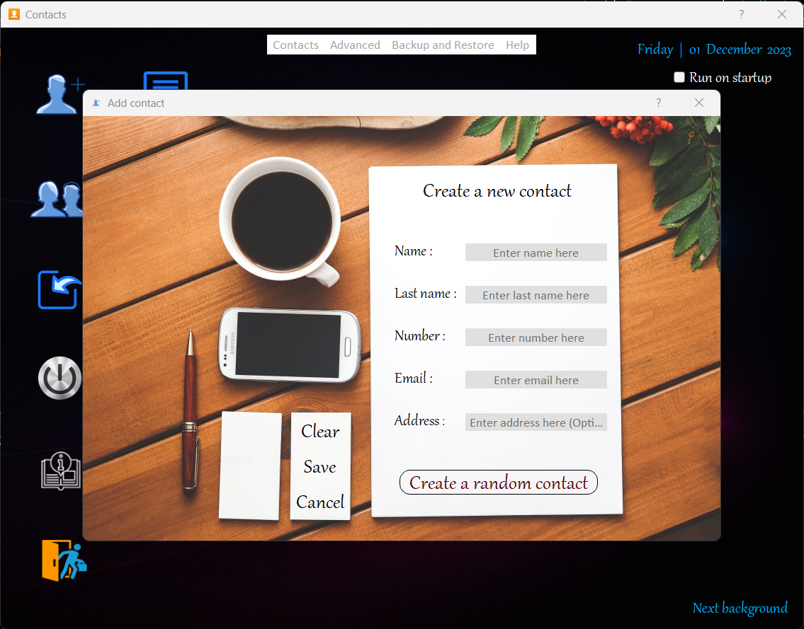
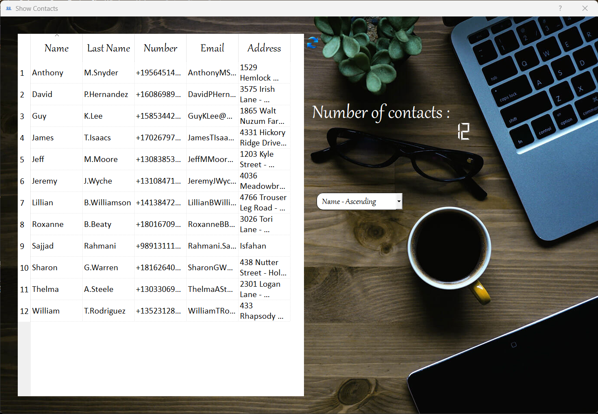

# Python Phonebook Application 

Here is a full-featured Phonebook application written in Python & PyQt5! 

Let's take a look at it in action:

## Demo Video

Here is a short demo showing the application in action:

**|-----> Click the image above to download the demo video.**

## Key Features

- Add, edit and delete contacts
- Search contacts by name or number
- Sort contacts by name, last name, number, email or address  
- Import/export contacts
- Text-to-speech support to read out contact details
- Nice graphical user interface

## Screenshots

## How to Use

To run this application yourself:

- Download or fork this repository  
- Install the required libraries:
  - `pip install PyQt5`
  - `pip install gtts`
  - `pip install playsound==1.2.2` 
  - `pip install requests`
- Turn up your system volume to hear audio notifications 
- Run `StartWindow.py`

That's it! Now you can enjoy using this app to manage your contacts.

## Customization

Here are some ideas to customize or extend this application:

- Add network requests to sync your contacts with remote storage
- Integrate messaging/calling APIs to communicate with contacts
- Enhance UI with additional widgets or pages  
- Support exporting contacts to email apps, Evernote etc.

The code is well-documented to help you understand and modify it.

So go ahead, fork this project and create your own personalized phonebook app!

## Credits

This application was created by [Rahmani Sajjad](https://github.com/RahmaniSajjad).

The Python libraries used include PyQt5, gtts, playsound and requests.

